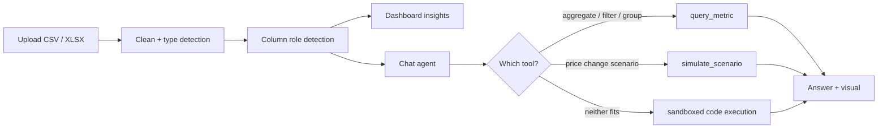

# BAsight

**Business Intelligence & Predictive Analytics for retail and e-commerce.**

Upload a sales spreadsheet, get a cleaned insights dashboard like in Power BI or Tableau. But BAsight goes one step further: ask questions in plain English that are answered by a tool-calling AI agent that computes against your actual data, ensuring accuracy and deeper analysis.

   

## Demo

**Part 1: upload to dashboard**

<video src="demo/dashboard_demo.mp4" controls width="100%"></video>

**Part 2: asking LLM questions**

<video src="demo/llm_agent_demo.mp4" controls width="100%"></video>

The `gemini-2.5-flash` model is used in the demo. Check out `backend\README.md` and `frontend\README.md` for a detailed explanation and breakdown of the code. A shorter explanation is given below:

## The workflow pipeline

A file goes through four stages before anything reaches the dashboard, and the same cleaned dataset backs both the dashboard and the chat agent, stored in-memory with a Universal Unique Identifer (UUID).

**1. Ingestion.** The uploaded CSV/XLSX is decoded with an encoding fallback chain (`utf-8-sig` → `utf-8` → `cp1252` → `latin-1`, the last of which never fails, so decoding always succeeds) and its delimiter found rather than assumed. Every text column is then evaluated for type coercion: currency symbols (`$£€¥`), thousands separators, `%` signs, and accounting-style negatives (`(12.50)` → `-12.50`) are stripped before attempting a numeric parse; a column only gets coerced if at least 90% of its non-null values parse successfully, so a column that's genuinely mixed text stays text. Date parsing works the same way with an 80% threshold, plus one extra step: numeric dates like `04/05/2025` are ambiguous (day-first vs. month-first), so the parser scans the column for a value that breaks the tie, for example,  `13/04/2025` can only be day-first, since no month is 13 and falls back to assuming day-first.

**2. Schema detection.** Each column gets assigned a semantic role — `date`, `product`, `category`, `quantity`, `price`, `revenue`, `identifier`, `customer` through token-bounded keyword matching against the column name (`unit_price` matches `price`; matching is against whole underscore-separated tokens, not raw substrings so `paid_amount` does *not* match `identifier` just because `"id"` is a substring of `"paid"`). The schema detection falls back to dtype- and cardinality-based heuristics when the column name gives no signal. This role map is the blueprint the rest of the system runs on: the dashboard uses it to know which column to sum for revenue, and the agent's tools use it to validate that a `simulate_scenario` call actually has a price and a quantity column to work with before running.

**3. Insights.** Total revenue (computed directly if a revenue/sales column exists, or derived as price × quantity if not), best-selling product, top 10 products, revenue over time auto-bucketed into daily/weekly/monthly resample windows based on how many days the date range spans, category breakdown, and period-over-period change (first half of the date range vs. second half). Anything that can't be computed ,no date column or no product column, is omitted with a specific reason in the response rather than a null the frontend has to interpret.

**4. Chat.** Covered in detail below:



## The agent

The design rule that drives this whole layer: every number the agent states has to be traceable to an actual computation, not the model's own arithmetic. That rules out just letting the model free-write and execute code as the primary path. This ensures trustworthy metrics derived from your data, and encourages responsible AI.

**Tool-calling first.** The model is given three tools and picks from them; it doesn't choose to write code unless neither of the first two can express the question.

- **`query_metric`** is the general-purpose one. Aggregates a numeric column (`sum`/`mean`/`count`/`min`/`max`/`median`), optionally filtered (`==`, `!=`, `>`, `>=`, `<`, `<=`, `in`, with automatic type coercion so a filter value like the string `"4"` still matches an int column) and optionally grouped either by a categorical column, ranked by magnitude, or by a date column bucketed into day/week/month, where the results are sorted chronologically rather than by value. Column names are validated against the actual dataset before running, so an unknown column comes back as an error message the model sees and can retry against.
- **`simulate_scenario`** — a price-change revenue projection. Takes `price_change_pct` and, critically, requires `assumed_demand_elasticity` as a non-optional argument — there's no default baked into the tool, so the model either asks the user for their assumption or states one explicitly as an assumption in its answer, rather than presenting a projection as fact. Computes baseline revenue against the real price and quantity columns, applies the price change and the resulting volume change from the elasticity, and returns baseline, projected, delta, and the assumption text together — the frontend renders all four, it doesn't hide the assumption from the user.
- **`execute_custom_analysis`** — the fallback, for whatever the first two can't express (correlation, an outlier-detection method). Requires a `reasoning` argument explaining why the other tools didn't suffice. The code runs in complete isolation.

**The loop** (`orchestrator.py`): the model is called with the full tool spec and the running conversation; if it returns tool calls, each is dispatched, the result serialized back into the conversation as a tool message, and the model is called again. There are up to 6 iterations, after which the turn is reported as having hit the cap rather than looping indefinitely. The system prompt includes the real column names, roles, and sample values for the specific dataset being discussed, injected once per conversation rather than re-sent every turn.

**The model**: Gemini via Google Cloud Vertex AI (`google-genai` SDK), authenticated through Application Default Credentials (ADC) rather than an API key. The LLM client is behind an interface (`LLMClient`), so the orchestration logic doesn't know or care which provider is underneath. An OpenAI-compatible client exists behind the same interface for portability, unused by default.

**The sandbox**: `execute_custom_analysis`'s code doesn't run in the backend process. It's serialized out to a Node.js subprocess, which boots an isolated Pyodide (Python-compiled-to-WebAssembly) runtime inside a `worker_thread`, reconstructs the dataset from a CSV string, and runs the model's code against it. Three things are true about that environment: it has no access to the real filesystem (Pyodide's `open()` operates on an in-memory virtual filesystem, not the disk), no network access, and no access to the host process's environment variables. The worker is spawned with an empty environment specifically so there's nothing to leak even if code inside it tries. A hard timeout is enforced by forcibly terminating the worker thread from outside it, not by a cooperative in-process timeout — a tight loop inside a synchronous WASM call doesn't yield control back to the event loop, so a same-thread timeout literally cannot interrupt it; only external termination can.

## Chat UI

The chat panel shows the model's text answer first, and then renders any successful tool results underneath it as a sequence of visuals. The frontend logic in `ResponseCard.tsx` iterates through all successful tool calls in order and builds one or more visual blocks

- `query_metric` with a single row becomes an `InlineMetric` headline value.
- `query_metric` with multiple rows becomes an `InlineChart`: area chart for date-grouped time series and bar chart for categorical groups.
- `simulate_scenario` becomes a `ScenarioComparison` with the current-vs-projected revenue delta from the tool result.
- `execute_custom_analysis` becomes `CustomResult`: a single number is rendered as a metric card, an array of objects becomes a compact table, and anything else is shown as formatted text.
- Failed tool calls are skipped. If no tool calls succeeded, the answer remains plain text.

## Stack

**Frontend** — Next.js 14 (App Router), TypeScript, Tailwind, Recharts.
**Backend** — FastAPI, pandas/NumPy, Pydantic (the argument/result schemas for every agent tool double as the JSON-schema source sent to the model, so the two can't drift apart).
**Agent** — Google Cloud Vertex AI / Gemini, a hand-written tool-calling loop rather than a framework like LangChain.
**Sandbox** — Node.js + Pyodide, run as an isolated subprocess per code execution.

## File structure layout

```
frontend/          Next.js app for dashboard and chat UI
backend/
  app/
    ingestion.py      File reading + cleaning
    schema_detection.py  Column role inference
    insights.py           Dashboard metrics
    storage.py              In-memory dataset store, per-session
    main.py                  API routes
    agent/                    query_metric / simulate_scenario / execute_custom_analysis,
                                the orchestration loop, the LLM client
  sandbox/            Isolated code execution for the agent's fallback tool
test_data/         Sample files for testing
demo/              video demos that show the app working
```

## Running it locally

Backend:

```bash
cd backend
pip install -r requirements.txt
cp .env.example .env   # set GOOGLE_CLOUD_PROJECT for chat, everything else works without it
uvicorn app.main:app --reload --port 8000

cd sandbox && npm install   # separately, for the fallback tool
```

Frontend:

```bash
cd frontend
npm install
cp .env.local.example .env.local
npm run dev
```